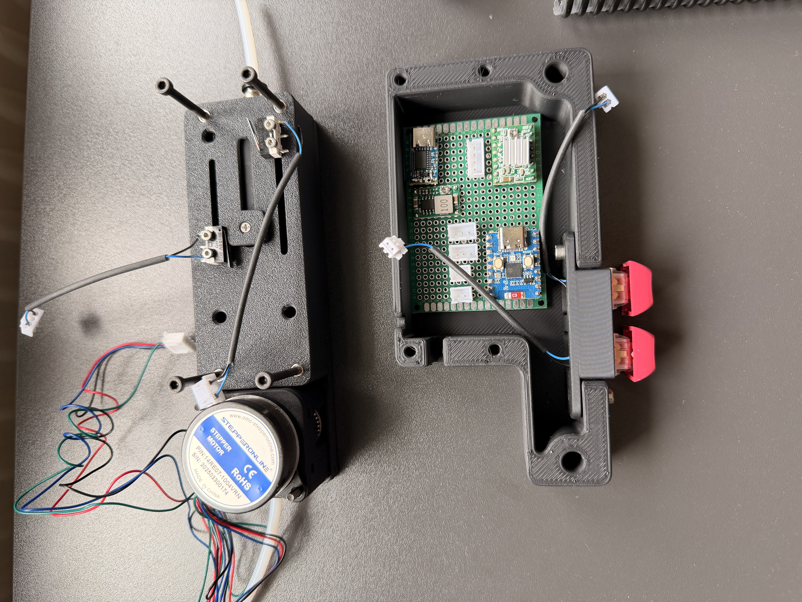

# 🧵 Active Filament Buffer / Extruder Assist

This project is an automated filament delivery system (buffer) for 3D printers. It monitors filament tension and presence to actively "push" material toward the printer, reducing the load on the printer's own extruder—especially useful for large setups or high-speed printing.

The entire system is fully assembled and soldered onto a permanent perfboard.

## 🚀 The Engineering Behind It

While many buffers are passive, this is an active system controlled by an ESP32 and a stepper motor.

### Technical Highlights:
* **AccelStepper Integration:** Utilizing the asynchronous `AccelStepper` library to handle precise step, direction, acceleration, and positioning without blocking the main state machine loop.
* **Industrial Logic Patterns:** Like my other projects, this uses my custom `Ton` (On-Delay) and `EdgePosNeg` classes to debounce sensors and manage timing-sensitive transitions.
* **Closed-Loop Logic:** The system uses mechanical endstops to determine when the buffer is empty and needs more material, or when it is full to prevent grinding or snapping.
* **Modular Architecture:** Clean separation of hardware configuration (`app_config.h`), PLC-style utilities, and the core process state machine (`main.cpp`).

## 🛠️ Features

* **Auto-Feeding:** Automatically detects when the buffer runs empty (`PIN_ENDSTOP_NEGATIVE`) and feeds a precise amount (approx. 30mm bursts) at controlled speeds.
* **Manual Override:** Physical buttons for "Jog Forward" and "Jog Backward" feature a 500ms filter delay to make manual filament loading and unloading easy.
* **Safety Interlocks:** Built-in limits via the positive safety endstop (`PIN_ENDSTOP_POSITIVE`) to instantly halt automatic feeding before mechanical damage occurs.
* **Status Monitoring:** Real-time serial debugging tracking sensor edges and state machine steps (e.g., tracking FSM steps like `Aktueller Schritt: 20`).

## 📁 Project Structure

* **src/main.cpp:** The core state machine managing the automated feeding process.
* **src/app_config.h:** Centralized pin mapping, configuration flags, and hardware constants.
* **src/Ton/ & src/EdgePosNeg/:** PLC-style timing and edge detection utilities used for advanced input debouncing.

## 🔧 Technical Stack

* **Controller:** ESP32-C3 (Waveshare ESP32-C3-DevKitM-1)
* **Framework:** Arduino / PlatformIO
* **Library:** AccelStepper
* **Language:** C++ (Object-Oriented)
* **Hardware:** Custom Soldered Perfboard (Lochrasterplatine)
